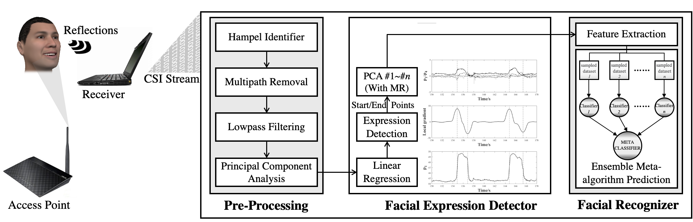
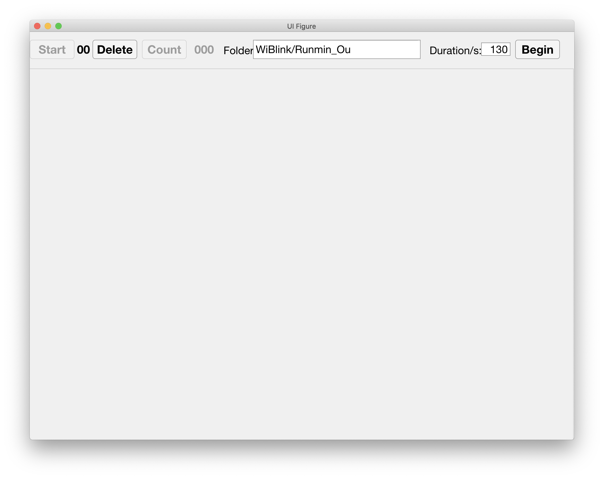

## WiFace

WiFace, a MATLAB application in Ubuntu 14.04 system that detects and recognizes user facial expressions (e.g., happy, fearful, surprised, happily surprised, angrily surprised, fearfully surprised) using Channel State Information (CSI) for Human-Computer Interface. Paper [WiFace: Facial Expression Recognition Using Wi-Fi Signals⬀](https://ieeexplore.ieee.org/abstract/document/9115830) is published in IEEE [Transactions on Mobile Computing (TMC)⬀](https://www.computer.org/csdl/journal/tm) (2020 Early access)

Todo list:

- [x] train data of the users
- [ ] A figure of real-time processing
- [ ] Description and figures of the result part
- [ ] Introduce WiBlink Application for real-time processing

Contents:

* [Environment Requirement](#environment-requirement)
* [Install Linux 802.11n CSI Tool](#install-linux-80211n-csi-tool)
* [Real-time data processing](#real-time-data-processing)
* [Results](#results)
* [Troubleshooting](#troubleshooting)



Fig. 1. System overview

## Environment Requirement

WiFace is tested on **Ubuntu 14.04 LTS** and **MATLAB 2018a** with a Thinkpad X200 equipped with an Intel Wi-Fi Link 5300 NIC. According to [Linux 802.11n CSI Tool - Installation Instructions⬀](https://dhalperi.github.io/linux-80211n-csitool/installation.html) and the latest MATLAB function used in scripts (hampel.m), the system and software requirements are:

1. Hardware: Intel Wi-Fi Link 5300 Wireless NIC
2. Linux kernel version: 3.2 ~ 4.2 (e.g., Ubuntu 12.04 ~ 14.04.4)
3. Linux 802.11n CSI Tool
4. Matlab 2015b and later

## Install Linux 802.11n CSI Tool

For 802.11n CSI Tool, please refer to [Linux 802.11n CSI Tool - Installation Instructions⬀](https://dhalperi.github.io/linux-80211n-csitool/installation.html) and follow the step-by-step instructions (while you can skip the commands in Tips).

After a successful try on logging the CSI data using

```shell
sudo linux-80211n-csitool-supplementary/netlink/log_to_file csi.dat
```

we can extract the CSI data from Intel 5300 NIC now. Compile my modified [log_to_file_online.c](./CSITool_Matlab/log_to_file_online.c) (that communicates with MATLAB script and records CSI data into hard disk via **write through** method) to an executable file using gcc

```shell
$ sudo cp ./data_collecting/log_to_file_online6.c ~/linux-80211n-csitool-supplementary/netlink/log_to_file_online.c
$ cd ~/linux-80211n-csitool-supplementary/netlink/
$ gcc log_to_file_online.c -o log_to_file_online
```

now we can use the executable file (log_to_file_online) to log the CSI data into the hard disk in real-time. (use 'nice -n ' with a negative number to raise the priority of the script)

```shell
$ sudo nice -n -10 linux-80211n-csitool-supplementary/netlink/log_to_file [your path on logging file]/test01.dat
```

## Real-time data processing

We use the MATLAB scripts in Linux 802.11n CSI Tool (linux-80211n-csitool-supplementary/matlab directory) to read the data and get the magnitude of channel state information. First add the path to the MATLAB:

```matlab
savepath('CSITool_Matlab'); % permanently
% addpath('CSITool_Matlab'); % temporarily
```

Using the [read_bf_file.m](./CSITool_Matlab/read_bf_file.m) we can read the channel state information traces. With other scripts in CSITool_Matlab, we can get the CSI data (in IQ domain) like this:

```matlab
file_name = './test.dat';
CSI_trace = read_bf_file(file_name);
len = size(CSI_trace, 1);
csi_data = zeros(30, len, 3);
for i = 1:len
	csi_entry = CSI_trace{i}; %for every packet
	csi = get_scaled_csi(csi_entry);
	csi = squeeze(csi(1, :, :)).';
	csi_data(:, i, :) = csi;
end
```

We modified the read_bf_file.m as [read_bf_file_online.m](/CSITool_Matlab/read_bf_file_online.m), which return the file cursor of the last legal CSI packet for real-time processing. Don forget to adjust the com_file to communicate with log_to_file_online.  When we run the [data_processing_online.m](./Code/data_processing_online.m) script, it will monitor the new file from the com_file and show the preprocessed CSI magnitude of last 5 seconds.

Then we can simulate the network communication (e.g., ping the router) in one terminal (positive number of nice will reduce the priority to occupy less resource of the computer)

```shell
$ nice -n 10 sudo ping 192.168.0.1 -i 0 -s 0 -q
```

and run the log_to_file_online program to collect the data.

```shell
$ sudo nice -n -10 sudo linux-80211n-csitool-supplementary/netlink/log_to_file_online matlab/Keystroke2/test.dat
```

 We can get the real-time processing result from MATLAB:


We use the [facial_expression_v5.m](./Code/facial_expression_v5.m) scrpit to process and extract the facial expression data. It requires to read the file information in [file2](./Data/WiFace_0907_Runmin_Ou_90cm/file2) including 1.File name; 2. Total time; 3. Start timestamp; 4. Ending timestamp 5. (optional) Unused antenna (0 to use all the antennas) 6. (optional) Expression count (ground truth). 

However, we need to record the file information manually. After the project of WiFace, our ongoing project is to detect the eye blinking of the user, although the resolution is far from detecting such subtle movements. We share the UI for counting actions while recording the CSI data. It can help us to record the information easily. 



## Results

Here are some result figures in our paper:


Fig. 14. Recognition accuracy for different users. 


Fig. 15. Overall confusion matrix. The class number 1- 6 refers to happy, fearful, surprised, happily surprised, angrily surprised, and fearfully surprised respectively. 

## Troubleshooting

TBC